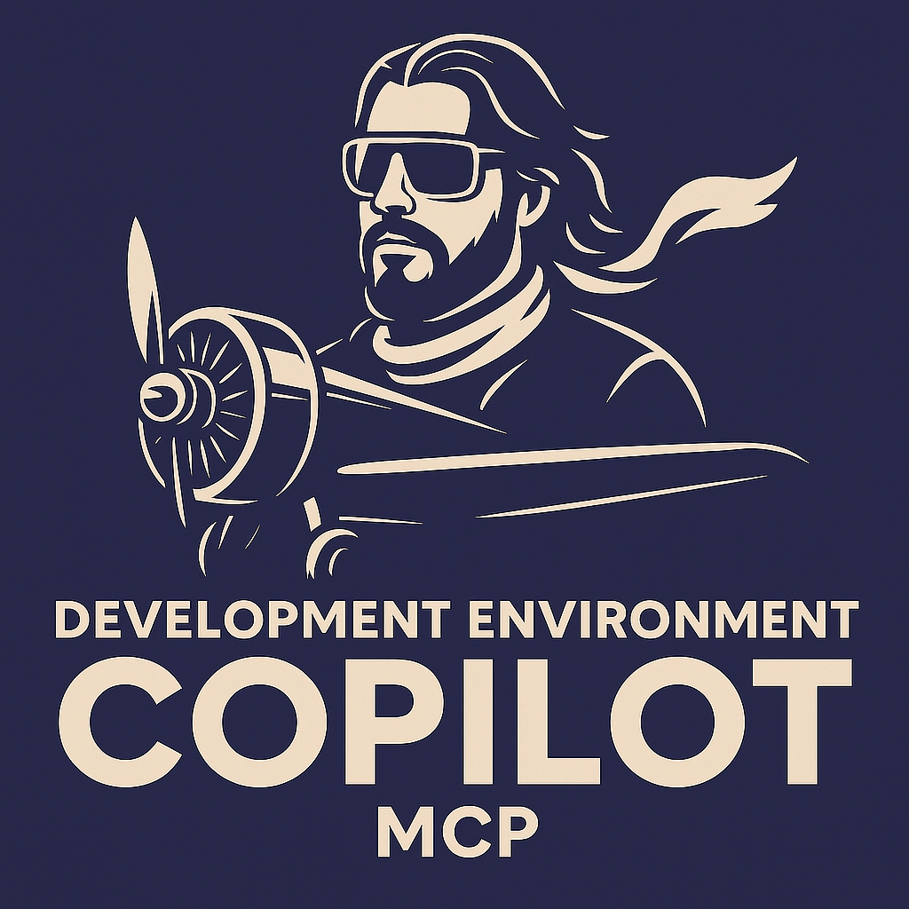

<div align="center">
  
  
  # Dev Environment Copilot
  
  **A Model Context Protocol (MCP) server that provides intelligent environment detection and command syntax assistance for cross-platform development workflows.**
</div>

> **Mission:** This MCP server aims to ensure users have a seamless experience with their prompts by automatically providing rich, context-aware environment information to AI agents and tools.

---

[](https://badge.fury.io/js/dev-env-copilot)
[](https://pypi.org/project/dev-env-copilot/)
[](https://opensource.org/licenses/MIT)

## ✨ Features

- 🔍 **Automatic Environment Detection** - Windows, Linux, macOS, and Raspberry Pi
- 🐚 **Shell-Aware Commands** - PowerShell, Bash, Zsh syntax optimization  
- 🤖 **GitHub Copilot Integration** - Seamless VS Code integration
- � **Global Context Injection** - Enhance all Copilot prompts with environment awareness
- �🌐 **Cross-Platform** - Works everywhere you develop
- 📦 **Multiple Installation Methods** - NPM, Pip, Docker
- 🔧 **Extensible** - Easy to customize and extend
- 🖥️ **Architecture-Aware** - Always detects and reports the current machine's architecture (e.g., x64, ARM, etc.) for every environment context

## 🚀 Quick Start

### VS Code Extension (Local Installation)
```bash
# Install the local extension package
code --install-extension vscode-extension/dev-env-copilot-extension-1.0.0.vsix
```

### NPM
```bash
# Install globally
npm install -g dev-env-copilot

# Or use without installing
npx dev-env-copilot
```

### Python/Pip
```bash
# Install from PyPI
pip install dev-env-copilot

# Run the server
python -m dev_environment_mcp.mcp_server
```

### Docker (Easiest)
```bash
# Run from Docker Hub (no installation needed)
docker run -i devenvcopilot/dev-env-copilot

# Or from GitHub Container Registry
docker run -i ghcr.io/yourusername/dev-env-copilot

# Test with a simple MCP request
echo '{"jsonrpc": "2.0", "method": "tools/list", "id": 1}' | docker run -i devenvcopilot/dev-env-copilot
```

## 🔧 VS Code Integration

### Extension-Based Setup (Recommended)

The **Dev Environment Copilot Extension** provides the easiest setup experience:

1. **Install the extension** using the local .vsix file
2. **Enable Global Context Injection** - Automatically enhances all Copilot prompts with environment awareness
3. **Configure custom instructions** - Add project-specific or team-wide guidelines that apply to all Copilot interactions

#### Global Context Injection Features

The extension includes advanced **Global Context Injection** that automatically adds environment information to your Copilot prompts:

```
# Your original prompt:
"How do I install pandas?"

# Enhanced prompt sent to Copilot:
Environment Context:
- OS: Windows 11
- Shell: PowerShell 7.4.0  
- Python: 3.11.7

Global Instructions:
Always consider cross-platform compatibility

User Query: How do I install pandas?
```

**Usage:**
- Use `@devEnvGlobalContext` in Copilot Chat for enhanced responses
- Enable via Command Palette: `Dev Env Copilot: Toggle Global Context Injection`
- Configure custom instructions: `Dev Env Copilot: Update Global Instructions`

See [GLOBAL_CONTEXT_INJECTION.md](docs/GLOBAL_CONTEXT_INJECTION.md) for complete documentation.

### Method 1: GitHub Copilot Chat Integration
Add to your VS Code settings (`.vscode/settings.json` or global settings):

```json
{
  "github.copilot.chat.experimental.mcp": {
    "enabled": true,
    "servers": {
      "dev-env-copilot": {
        "command": "npx",
        "args": ["dev-env-copilot"]
      }
    }
  }
}
```

### Method 2: Docker Integration
```json
{
  "github.copilot.chat.experimental.mcp": {
    "enabled": true,
    "servers": {
      "dev-env-copilot": {
        "command": "docker",
        "args": [
          "run", "--rm", "--interactive",
          "dev-env-copilot"
        ]
      }
    }
  }
}
```

### Method 3: Task Integration
Add to `.vscode/tasks.json`:

```json
{
  "version": "2.0.0",
  "tasks": [
    {
      "label": "detect-environment",
      "type": "shell",
      "command": "npx",
      "args": ["dev-env-copilot", "detect-environment"],
      "group": "build"
    }
  ]
}
```

```json
{
  "github.copilot.chat.experimental.mcp": {
    "enabled": true,
    "servers": {
      "dev-env-copilot-docker": {
        "command": "docker",
        "args": [
          "run", "--rm", "--interactive",
          "--volume", "${workspaceFolder}:/workspace:ro",
          "dev-env-copilot-test:latest"
        ]
      }
    }
  }
}
```

See [VSCODE_INTEGRATION_SUMMARY.md](VSCODE_INTEGRATION_SUMMARY.md) for complete VS Code setup instructions.

## 📖 Full Installation Guide

See [INSTALLATION.md](INSTALLATION.md) for detailed installation instructions, configuration examples, and troubleshooting.

## ✅ Installation Verification Status

All installation methods have been tested and verified:

| Method | Status | Environment | Notes |
|--------|--------|-------------|-------|
| **Python/pip** | ✅ **VERIFIED** | Native | Recommended for most users |
| **NPM/Node.js** | ✅ **VERIFIED** | Cross-platform | Node.js wrapper tested |
| **Docker** | ✅ **VERIFIED** | Container/Linux | Full container isolation |
| **MCP Protocol** | ✅ **VERIFIED** | All platforms | MCP 2024-11-05 compliant |

*Last verified: June 6, 2025 - All tests passing (4/4)*

## VS Code Integration

### Method 1: Direct MCP Integration

Add to `.vscode/settings.json`:

```json
{
  "mcp.servers": {
    "dev-environment": {
      "command": "dev-env-mcp",
      "args": ["--mcp-mode"],
      "transport": "stdio"
    }
  }
}
```

### Method 2: Task Integration

Add to `.vscode/tasks.json`:

```json
{
  "version": "2.0.0",
  "tasks": [
    {
      "label": "detect-environment",
      "type": "shell",
      "command": "dev-env-mcp",
      "args": ["detect-environment", "--format", "copilot"],
      "group": "build"
    }
  ]
}
```

### Method 3: Extension Integration

Install the companion VS Code extension:

1. Open VS Code Extensions (`Ctrl+Shift+X`)
2. Search for "Development Environment MCP"
3. Install and reload VS Code

## Copilot Integration

The server provides context-aware assistance for:

- **Terminal Commands**: Automatically formats commands for your OS/shell
- **Environment Variables**: Correct syntax for setting env vars
- **File Operations**: Platform-appropriate file manipulation commands
- **Development Workflows**: Context-aware suggestions for common dev tasks

### Example Usage with Copilot

```
User: "Run the tests"
Copilot: (detects Windows PowerShell) "python -m pytest test/"

User: "Run the tests" 
Copilot: (detects Linux) "python3 -m pytest test/"

User: "Set environment variable"
Copilot: (Windows) "$env:PYTHONPATH = 'c:\dev\project'"
Copilot: (Linux) "export PYTHONPATH=/home/user/project"
```

## Available Tools

The MCP server exposes these tools:

### `detect_environment`
Detects current OS, shell, hardware, and provides environment context.

**Parameters:**
- `format` (string): Output format - "json", "summary", "copilot"

### `get_command_syntax`
Provides correct command syntax for the current environment.

**Parameters:**
- `operation` (string): Operation type - "test", "build", "deploy", "install"
- `target` (string, optional): Target environment - "local", "remote", "pi"
- `format` (string): Output format - "shell", "explanation", "examples"

### `format_command`
Formats a generic command for the current environment.

**Parameters:**
- `command_template` (string): Template command with placeholders
- `variables` (object): Variables to substitute in template

### `get_project_context`
Analyzes current project structure and provides relevant context.

**Parameters:**
- `include_files` (boolean): Include file listing in output
- `analyze_dependencies` (boolean): Analyze package.json/requirements.txt

## Configuration

### Environment Variables

- `DEV_ENV_MCP_CONFIG`: Path to custom configuration file
- `DEV_ENV_MCP_LOG_LEVEL`: Logging level (DEBUG, INFO, WARN, ERROR)
- `DEV_ENV_MCP_CACHE_TTL`: Cache TTL for environment detection (seconds)

### Custom Configuration

Create a `dev-env-mcp.json` config file:

```json
{
  "detection": {
    "cache_ttl": 300,
    "enable_hardware_detection": true,
    "custom_environments": {
      "my-docker": {
        "detect_command": "cat /.dockerenv",
        "shell": "bash",
        "python_cmd": "python3"
      }
    }
  },
  "commands": {
    "custom_operations": {
      "my-build": {
        "windows": "msbuild /p:Configuration=Release",
        "linux": "make build",
        "macos": "xcodebuild -configuration Release"
      }
    }
  }
}
```

## 💻 Command Line Usage

### Standalone Commands
```bash
# Environment detection
npx dev-env-copilot detect-environment --format json

# Command syntax help
npx dev-env-copilot get-command-syntax --operation test --target local
npx dev-env-copilot get-command-syntax --operation deploy --target pi --format explanation

# MCP server modes
npx dev-env-copilot --mcp-mode --transport stdio
npx dev-env-copilot --mcp-mode --transport http --host 0.0.0.0 --port 9000
```

### Advanced Configuration

#### Environment Variables
- `DEV_ENV_MCP_LOG_LEVEL`: Set logging level (DEBUG, INFO, WARN, ERROR)
- `DEV_ENV_MCP_CACHE_TTL`: Cache duration for environment detection (seconds)
- `DEV_ENV_MCP_CONFIG`: Path to custom configuration file

#### Custom Configuration File
Create `~/.config/dev-env-mcp/config.json`:

```json
{
  "detection": {
    "cache_ttl": 300,
    "enable_hardware_detection": true,
    "custom_project_roots": [
      "/custom/dev/path",
      "c:\\custom\\dev\\path"
    ]
  },
  "commands": {
    "custom_operations": {
      "my-test": {
        "windows": "npm test",
        "linux": "npm test",
        "pi": "sudo npm test"
      }
    }
  },
  "logging": {
    "level": "INFO",
    "file": "~/.local/logs/dev-env-mcp.log"
  }
}
```

## 🔥 Integration Examples

### GitHub Copilot Chat
The server enhances GitHub Copilot with environment awareness:

```
👤 User: "How do I run tests in this project?"
🤖 Copilot: Based on your Windows PowerShell environment and package.json, run:
         npm test
         
👤 User: "Set up a Python virtual environment"  
🤖 Copilot: For Windows PowerShell:
         python -m venv venv
         .\venv\Scripts\Activate.ps1
```

### Terminal Command Generation
```
👤 User: "Install dependencies and start dev server"
🤖 Copilot: (detects Node.js project on Windows)
         npm install && npm run dev
         
👤 User: "Same command but for production"
🤖 Copilot: npm ci && npm run build && npm start
```

## 🛠 API Reference

### MCP Tools

#### `detect_environment`
Returns comprehensive environment information.

**Response:**
```json
{
  "os": "windows",
  "shell": "powershell", 
  "architecture": "x64",
  "python_version": "3.11.0",
  "node_version": "18.17.0",
  "hardware": "desktop"
}
```

#### `get_command_syntax`
**Parameters:**
- `operation`: "test" | "build" | "deploy" | "install" | "run"
- `target`: "local" | "remote" | "pi" | "docker"
- `format`: "shell" | "explanation" | "examples"

#### `format_command`
**Parameters:**
- `command_template`: Template with `{variables}`
- `variables`: Object with substitution values

## 🐛 Troubleshooting

### Common Issues

#### "Command not found" errors
```bash
# Ensure installation
npm list -g dev-env-copilot

# Or reinstall
npm install -g dev-env-copilot
```

#### VS Code Integration not working
1. Check VS Code settings for MCP configuration
2. Restart VS Code after configuration changes
3. Check VS Code Developer Console for errors (`Help > Toggle Developer Tools`)

#### Docker permission issues
```bash
# Linux/macOS - add user to docker group
sudo usermod -aG docker $USER

# Windows - ensure Docker Desktop is running
```

### Debug Mode
Enable detailed logging:

```bash
# Environment variable
export DEV_ENV_MCP_LOG_LEVEL=DEBUG

# Or via config file
{
  "logging": {
    "level": "DEBUG",
    "file": "~/.local/logs/dev-env-mcp.log"
  }
}
```

## 📚 Additional Documentation

- [Installation Guide](INSTALLATION.md) - Detailed setup instructions
- [Docker Setup](DOCKER_SETUP_GUIDE.md) - Container deployment
- [VS Code Integration](DOCKER_VSCODE_INTEGRATION.md) - Advanced IDE setup
- [Configuration Examples](examples/) - Sample configurations

## 🤝 Contributing

We welcome contributions! Please see our [Contributing Guide](CONTRIBUTING.md) for details.

### Development Setup
```bash
git clone https://github.com/0nilinkz/dev-env-copilot.git
cd dev-env-copilot
npm install
npm run test
```

## 📄 License

This project is licensed under the MIT License - see the [LICENSE](LICENSE) file for details.

## 🙏 Acknowledgments

- Model Context Protocol (MCP) by Anthropic
- GitHub Copilot team for MCP integration
- Cross-platform development community

---

**Questions?** Open an [issue](https://github.com/0nilinkz/dev-env-copilot/issues) or start a [discussion](https://github.com/0nilinkz/dev-env-copilot/discussions)!
