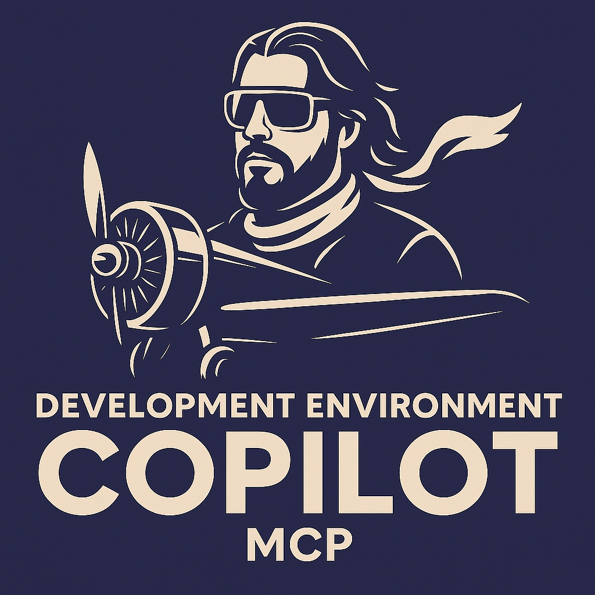

<div align="center">
  
  
  # Dev Environment Copilot
  
  **A production-ready Model Context Protocol (MCP) server that provides intelligent environment detection and command syntax assistance for cross-platform development workflows.**
</div>

> **Mission:** This MCP server ensures users have a seamless experience with their prompts by automatically providing rich, context-aware environment information to AI agents and tools.

---

[](https://badge.fury.io/js/dev-env-copilot)
[](https://pypi.org/project/dev-env-copilot/)
[](https://hub.docker.com/r/0nilinkz/dev-env-copilot)
[](https://opensource.org/licenses/MIT)
[](https://github.com/yourusername/dev-env-copilot/actions)

## ✨ Features

- 🔍 **Automatic Environment Detection** - Windows, Linux, and macOS
- 🐚 **Shell-Aware Commands** - PowerShell, Bash, Zsh syntax optimization  
- 🤖 **VS Code Insiders MCP Integration** - Seamless integration with GitHub Copilot
- 🌐 **Cross-Platform** - Works everywhere you develop
- 📦 **Multiple Installation Methods** - NPM, PyPI, Docker Hub
- 🔧 **Extensible** - Easy to customize and extend
- 🖥️ **Architecture-Aware** - Always detects and reports system architecture
- 🚀 **Production Ready** - Comprehensive test coverage and automated CI/CD

## 🚀 Quick Start

### NPM (Recommended)
```bash
# Install globally
npm install -g dev-env-copilot

# Or use without installing
npx dev-env-copilot
```

### Python/PyPI
```bash
# Install from PyPI
pip install dev-env-copilot

# Run the server
python -m dev_environment_mcp.server
```

### Docker (Easiest)
```bash
# Run from Docker Hub (no installation needed)
docker run -i 0nilinkz/dev-env-copilot

# Or from GitHub Container Registry
docker run -i ghcr.io/yourusername/dev-env-copilot

# Test with a simple MCP request
echo '{"jsonrpc": "2.0", "method": "tools/list", "id": 1}' | docker run -i 0nilinkz/dev-env-copilot
```

## 🔧 VS Code Insiders Integration

### MCP Server Setup (Recommended)

Add to your **VS Code Insiders** MCP configuration file:

**Windows**: `%APPDATA%\Code - Insiders\User\globalStorage\rooveterinaryinc.roo-cline\settings\cline_mcp_settings.json`
**macOS**: `~/Library/Application Support/Code - Insiders/User/globalStorage/rooveterinaryinc.roo-cline/settings/cline_mcp_settings.json`
**Linux**: `~/.config/Code - Insiders/User/globalStorage/rooveterinaryinc.roo-cline/settings/cline_mcp_settings.json`

```json
{
  "mcpServers": {
    "dev-environment": {
      "command": "npx",
      "args": ["dev-env-copilot"]
    }
  }
}
```

See [VSCODE_INSIDERS_MCP_SETUP.md](VSCODE_INSIDERS_MCP_SETUP.md) for complete setup instructions.

### Alternative Integration Methods

#### Method 1: Docker Integration
```json
{
  "mcpServers": {
    "dev-env-copilot-docker": {
      "command": "docker",
      "args": [
        "run", "--rm", "--interactive",
        "0nilinkz/dev-env-copilot"
      ]
    }
  }
}
```

#### Method 2: Python Installation
```json
{
  "mcpServers": {
    "dev-env-copilot-python": {
      "command": "python",
      "args": ["-m", "dev_environment_mcp.server"]
    }
  }
}
```

### Example Usage with Copilot

```
User: "Run the tests"
Copilot: (detects Windows PowerShell) "python -m pytest test/"

User: "Run the tests" 
Copilot: (detects Linux) "python3 -m pytest test/"

User: "Set environment variable"
Copilot: (Windows) "$env:PYTHONPATH = 'c:\dev\project'"
Copilot: (Linux) "export PYTHONPATH=/home/user/project"
```

## 📊 Production Ready

### Automated CI/CD Pipeline
- ✅ **Multi-platform testing** - Ubuntu, Windows, macOS
- ✅ **Multi-version support** - Python 3.8-3.12
- ✅ **Automated publishing** - NPM, PyPI, Docker Hub
- ✅ **Stage-based deployment** - Tests must pass before deployment
- ✅ **Independent deployments** - Each registry deploys separately

### Comprehensive Test Coverage
```bash
# All installation methods verified
✅ Python/PyPI     - Native execution
✅ NPM/Node.js     - Cross-platform wrapper
✅ Docker          - Multi-architecture builds
✅ MCP Protocol    - Full protocol compliance
```

See [DEPLOYMENT_SETUP.md](DEPLOYMENT_SETUP.md) for deployment architecture details.

## Available Tools

The MCP server exposes these tools:

### `detect_environment`
Detects current OS, shell, hardware, and provides environment context.

**Parameters:**
- `format` (string): Output format - "json", "summary", "copilot"

### `get_command_syntax`
Provides correct command syntax for the current environment.

**Parameters:**
- `operation` (string): Operation type - "test", "build", "deploy", "install"
- `target` (string, optional): Target environment - "local", "remote", "pi"
- `format` (string): Output format - "shell", "explanation", "examples"

### `format_command`
Formats a generic command for the current environment.

**Parameters:**
- `command_template` (string): Template command with placeholders
- `variables` (object): Variables to substitute in template

### `get_project_context`
Analyzes current project structure and provides relevant context.

**Parameters:**
- `include_files` (boolean): Include file listing in output
- `analyze_dependencies` (boolean): Analyze package.json/requirements.txt

## Configuration

### Environment Variables

- `DEV_ENV_MCP_CONFIG`: Path to custom configuration file
- `DEV_ENV_MCP_LOG_LEVEL`: Logging level (DEBUG, INFO, WARN, ERROR)
- `DEV_ENV_MCP_CACHE_TTL`: Cache TTL for environment detection (seconds)

### Custom Configuration

Create a `dev-env-mcp.json` config file:

```json
{
  "detection": {
    "cache_ttl": 300,
    "enable_hardware_detection": true,
    "custom_environments": {
      "my-docker": {
        "detect_command": "cat /.dockerenv",
        "shell": "bash",
        "python_cmd": "python3"
      }
    }
  },
  "commands": {
    "custom_operations": {
      "my-build": {
        "windows": "msbuild /p:Configuration=Release",
        "linux": "make build",
        "macos": "xcodebuild -configuration Release"
      }
    }
  }
}
```

## 💻 Command Line Usage

### Standalone Commands
```bash
# Environment detection
npx dev-env-copilot detect-environment --format json

# Command syntax help
npx dev-env-copilot get-command-syntax --operation test --target local
npx dev-env-copilot get-command-syntax --operation deploy --target pi --format explanation

# MCP server modes
npx dev-env-copilot --mcp-mode --transport stdio
npx dev-env-copilot --mcp-mode --transport http --host 0.0.0.0 --port 9000
```

### Advanced Configuration

#### Environment Variables
- `DEV_ENV_MCP_LOG_LEVEL`: Set logging level (DEBUG, INFO, WARN, ERROR)
- `DEV_ENV_MCP_CACHE_TTL`: Cache duration for environment detection (seconds)
- `DEV_ENV_MCP_CONFIG`: Path to custom configuration file

#### Custom Configuration File
Create `~/.config/dev-env-mcp/config.json`:

```json
{
  "detection": {
    "cache_ttl": 300,
    "enable_hardware_detection": true,
    "custom_project_roots": [
      "/custom/dev/path",
      "c:\\custom\\dev\\path"
    ]
  },
  "commands": {
    "custom_operations": {
      "my-test": {
        "windows": "npm test",
        "linux": "npm test",
        "pi": "sudo npm test"
      }
    }
  },
  "logging": {
    "level": "INFO",
    "file": "~/.local/logs/dev-env-mcp.log"
  }
}
```

## 🔥 Integration Examples

### GitHub Copilot Chat
The server enhances GitHub Copilot with environment awareness:

```
👤 User: "How do I run tests in this project?"
🤖 Copilot: Based on your Windows PowerShell environment and package.json, run:
         npm test
         
👤 User: "Set up a Python virtual environment"  
🤖 Copilot: For Windows PowerShell:
         python -m venv venv
         .\venv\Scripts\Activate.ps1
```

### Terminal Command Generation
```
👤 User: "Install dependencies and start dev server"
🤖 Copilot: (detects Node.js project on Windows)
         npm install && npm run dev
         
👤 User: "Same command but for production"
🤖 Copilot: npm ci && npm run build && npm start
```

## 🛠 API Reference

### MCP Tools

#### `detect_environment`
Returns comprehensive environment information.

**Response:**
```json
{
  "os": "windows",
  "shell": "powershell", 
  "architecture": "x64",
  "python_version": "3.11.0",
  "node_version": "18.17.0",
  "hardware": "desktop"
}
```

#### `get_command_syntax`
**Parameters:**
- `operation`: "test" | "build" | "deploy" | "install" | "run"
- `target`: "local" | "remote" | "pi" | "docker"
- `format`: "shell" | "explanation" | "examples"

#### `format_command`
**Parameters:**
- `command_template`: Template with `{variables}`
- `variables`: Object with substitution values

## 🐛 Troubleshooting

### Common Issues

#### "Command not found" errors
```bash
# Check NPM installation
npm list -g dev-env-copilot

# Reinstall if needed
npm install -g dev-env-copilot

# Check Python installation
pip show dev-env-copilot
```

#### VS Code Insiders MCP integration not working
1. Verify MCP configuration file location and format
2. Restart VS Code Insiders after configuration changes
3. Check VS Code Developer Console for errors (`Help > Toggle Developer Tools`)
4. Ensure you're using VS Code Insiders (not regular VS Code)

#### Docker permission issues
```bash
# Linux/macOS - add user to docker group
sudo usermod -aG docker $USER
newgrp docker

# Windows - ensure Docker Desktop is running
```

#### MCP Protocol Issues
```bash
# Test MCP server directly
echo '{"jsonrpc": "2.0", "method": "tools/list", "id": 1}' | npx dev-env-copilot

# Test Python server
echo '{"jsonrpc": "2.0", "method": "tools/list", "id": 1}' | python -m dev_environment_mcp.server
```

### Debug Mode
Enable detailed logging:

```bash
# Set environment variable
export DEV_ENV_MCP_LOG_LEVEL=DEBUG

# Or create config file with debug logging
echo '{"logging": {"level": "DEBUG"}}' > ~/.config/dev-env-mcp/config.json
```

## 📚 Additional Documentation

- [VS Code Insiders MCP Setup](VSCODE_INSIDERS_MCP_SETUP.md) - Complete integration guide
- [Deployment Setup](DEPLOYMENT_SETUP.md) - CI/CD pipeline and workflow architecture
- [Docker Setup](DOCKER_SETUP_GUIDE.md) - Container deployment guide
- [Docker VS Code Integration](DOCKER_VSCODE_INTEGRATION.md) - Advanced containerized setup
- [Integration Guide](docs/INTEGRATION_GUIDE.md) - Technical integration details
- [Distribution Summary](docs/DISTRIBUTION_SUMMARY.md) - Deployment and publishing overview

## 🏗️ Development & Contributing

### Quick Development Setup
```bash
git clone https://github.com/yourusername/dev-env-copilot.git
cd dev-env-copilot

# Install dependencies
npm install
pip install -e .

# Run tests
python tests/test_mcp_proper.py
node bin/dev-env-copilot.js < echo '{"jsonrpc":"2.0","method":"initialize","id":1,"params":{}}'
```

### Workflow Structure
Our CI/CD uses GitHub Actions with a modern **stage-based architecture**:

```
Test Stage (test-and-build.yml)
├── Multi-platform testing (Ubuntu, Windows, macOS)
├── Multi-version testing (Python 3.8-3.12)
└── MCP protocol compliance verification

Deploy Stage (on release)
├── deploy-pypi.yml    → PyPI publishing
├── deploy-npm.yml     → npm registry  
└── docker-deploy.yml  → Docker Hub + GHCR
```

**Key Features:**
- 🔒 **Reliable**: No deployment without passing tests
- 🔧 **Modular**: Each deployment type is independent  
- ⚡ **Efficient**: Reusable workflows, no duplication
- 🎯 **Flexible**: Deploy to specific registries independently

### Contributing
We welcome contributions! The project is well-structured with:
- ✅ Comprehensive test coverage
- ✅ Automated quality checks
- ✅ Clear documentation
- ✅ Modern development workflow

Please open an issue or pull request to get started.

## 📄 License

This project is licensed under the MIT License - see the [LICENSE](LICENSE) file for details.

## 🙏 Acknowledgments

- Model Context Protocol (MCP) by Anthropic
- GitHub Copilot team for MCP integration
- Cross-platform development community

---

**Questions?** Open an [issue](https://github.com/0nilinkz/dev-env-copilot/issues) or start a [discussion](https://github.com/0nilinkz/dev-env-copilot/discussions)!
